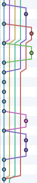
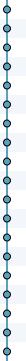
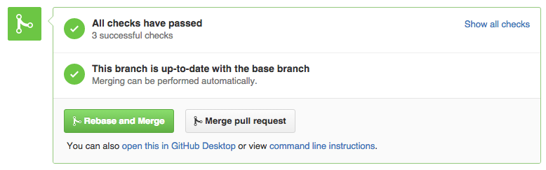

# rebase-and-merge

## Deprecation notice

This has become unusable due to `webtask` shutting down the script. See alternative solutions:

1. [Native Github Support](https://github.com/blog/2243-rebase-and-merge-pull-requests)
2. [Remergr.io](http://remergr.io) ***free*** *for open source projects*

## What❓

When you want to merge a PR, you click the "Merge Pull Request" button. When you click that button, GitHub will run the merge command with the `--no-ff` option
([source](https://help.github.com/articles/merging-a-pull-request/)). What this means is you get an additional commit in your git history (even if it's not needed).

This gives you the ability to easily rebase and perform [a fast forward merge](http://ariya.ofilabs.com/2013/09/fast-forward-git-merge.html).

## Why? 😕

When not doing a fast forward merge, your git history looks like this:



Chaos. This makes it pretty difficult to figure out what code is where and when and how it got there.

When you rebase and only do fast forward merges, you get a git history that looks like this:



A nice, clean, straight line. This makes it sooooo much nicer!

Unfortunately, GitHub is silent on whether it will ever allow fast-forward merges for merges by default. So I created this to do it for you!

## How? 😎

This is still a work in progress. The goal is to eventually make a Chrome Extension that adds a `Rebase and Merge`
button:



For now, it's just a bookmarklet. You'll have to do a few things to get this working. But it should work just fine!

First you're going to need to [create a personal token](https://help.github.com/articles/creating-an-access-token-for-command-line-use/) that has `repo` access (doesn't need anything else).

Then you'll want to alter this JavaScript so it has your information for the `token`, `userName`, and `userEmail`.

```javascript
var params = {
  token: 'YOUR_TOKEN',
  userName: 'Your Name',
  userEmail: 'your@email.com',
  baseRepo: /(http.*?github\.com\/.*?\/.*?)\/pull/.exec(location.href)[1],
  depth: getDepth()
};

var ghHeaderMeta = document.querySelector('.gh-header-meta');
var commitRefs = ghHeaderMeta.querySelectorAll('.commit-ref');
var baseRef = getOrgAndBranch(commitRefs[0]);
var prRef = getOrgAndBranch(commitRefs[1]);

params.baseBranch = baseRef.branch;
params.prBranch = prRef.branch;
if (prRef.org) {
  params.prRepo = params.baseRepo.replace(/github\.com\/(.*?)\//, 'github.com/' + prRef.org + '/')
} else {
  params.prRepo = params.baseRepo;
}

var paramArray = [];
Object.keys(params).forEach(function(key) {
  if (params[key] !== undefined) {
    paramArray.push(key + '=' + encodeURIComponent(params[key]));
  }
});


window.open('https://webtask.it.auth0.com/api/run/wt-kent+github-doddsfamily_us-0/rebase-and-merge?webtask_no_cache=1&' + paramArray.join('&'), '_blank');


function getOrgAndBranch(commitRef) {
  var targets = commitRef.querySelectorAll('.css-truncate-target');
  var org, branch;
  if (targets.length !== 1) {
    org = targets[0].innerText;
    branch = targets[1].innerText;
  } else {
    branch = targets[0].innerText;
  }
  return {org: org, branch: branch};
}

function getDepth() {
  const commitCount = parseInt(document.getElementById('commits_tab_counter').textContent.trim());
  if (commitCount <=25) {
    return commitCount * 2;
  }
}
```

Then [minify it](https://marijnhaverbeke.nl/uglifyjs).

So it should look something like this:

```javascript
function getOrgAndBranch(a){var c,d,b=a.querySelectorAll(".css-truncate-target");return 1!==b.length?(c=b[0].innerText,d=b[1].innerText):d=b[0].innerText,{org:c,branch:d}}var params={token:"YOUR_TOKEN",userName:"Your Name",userEmail:"your@email.com",baseRepo:/(http.*?github\.com\/.*?\/.*?)\/pull/.exec(location.href)[1]},ghHeaderMeta=document.querySelector(".gh-header-meta"),commitRefs=ghHeaderMeta.querySelectorAll(".commit-ref"),baseRef=getOrgAndBranch(commitRefs[0]),prRef=getOrgAndBranch(commitRefs[1]);params.baseBranch=baseRef.branch,params.prBranch=prRef.branch,prRef.org?params.prRepo=params.baseRepo.replace(/github\.com\/(.*?)\//,"github.com/"+prRef.org+"/"):params.prRepo=params.baseRepo;var paramArray=[];Object.keys(params).forEach(function(a){paramArray.push(a+"="+encodeURIComponent(params[a]))}),window.open("https://webtask.it.auth0.com/api/run/wt-kent+github-doddsfamily_us-0/rebase-and-merge?webtask_no_cache=1&"+paramArray.join("&"),"_blank");
```

Then [turn it into a bookmarklet](http://mrcoles.com/bookmarklet/)

Then navigate to the PR on github.

Then click your bookmarklet

Then it's rebased and merged!


## FAQ

Q: How do I know you're not stealing my token

A: Look at the code in `webtask/` and you'll see there's nothing in there to steal your token. And you'll also notice
that anywhere there's a log or any display of information, your token is hidden from the output. Don't worry, you're
fine :-)

